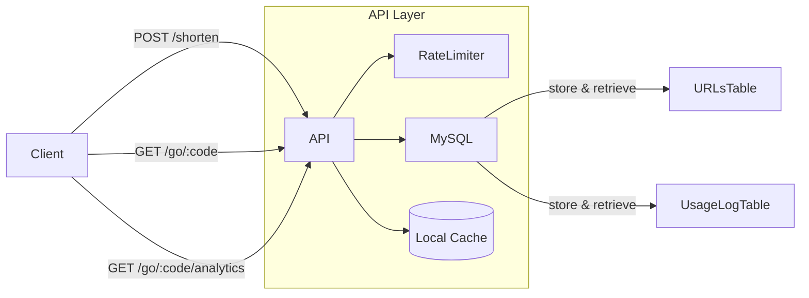

# URL Shortener Service

A robust URL shortening web service providing customizable link expiration, one-time use links, analytics, and rate limiting features.

---

## Table of Contents

- [URL Shortener Service](#url-shortener-service)
  - [Table of Contents](#table-of-contents)
  - [Description](#description)
  - [Features and Architecture](#features-and-architecture)
  - [Tech Stack](#tech-stack)
  - [Architecture Diagram](#architecture-diagram)
  - [API Documentation](#api-documentation)
    - [Shorten URL](#shorten-url)
    - [Redirect to URL](#redirect-to-url)
    - [Analytics](#analytics)
  - [Database Schema](#database-schema)
    - [URLs Table](#urls-table)
  - [Tradeoffs and Architectural Decisions](#tradeoffs-and-architectural-decisions)
  - [Future Improvements](#future-improvements)

---

## Description

This project implements a URL shortening service. It generates short, unique codes for long URLs, with added features like expiration, one-time use restrictions, analytics tracking, and built-in rate limiting to protect resources.

---

## Features and Architecture

* **URL Shortening:** Generates random 6-character alphanumeric codes (over 56 billion possible combinations), ensuring low collision probability.
* **Expiration:** Links expire after 24 hours by default or a custom expiration date.
* **One-Time Links:** Shortened URLs can be marked as one-time use.
* **Analytics:** Track the number of visits to each shortened URL, along with detailed usage logs including IP addresses and user agents.
* **Rate Limiting:** Implemented with a fixed-window algorithm to prevent abuse, initially using in-memory caching with a future plan for distributed caching.

---

## Tech Stack

* **Node.js 22**
* **TypeScript**
* **Fastify** (web framework)
* **Typebox** (schema validation)
* **Jest** (testing framework)
* **Docker Compose**
* **MySQL**
* **Knex** (ORM)

---

## Architecture Diagram



---

## API Documentation

### Shorten URL

**POST** `/shorten`

Request:

```json
{
  "url": "https://example.com",
  "one_time": true // optional
}
```

Response:

```json
{
  "code": "aB3x9Z"
}
```

### Redirect to URL

**GET** `/go/:code`

Redirects user to the original URL. Handles expiration and one-time use logic.

### Analytics

**GET** `/go/:code/analytics`

Response:

```json
{
  "visits": 42
}
```

---

## Database Schema

### URLs Table

```sql
CREATE TABLE urls (
  id INT AUTO_INCREMENT PRIMARY KEY,
  original_url VARCHAR(2048) NOT NULL,
  code VARCHAR(6) UNIQUE NOT NULL,
  one_time BOOLEAN DEFAULT FALSE,
  visits INT DEFAULT 0,
  created_at TIMESTAMP DEFAULT CURRENT_TIMESTAMP,
  updated_at TIMESTAMP DEFAULT CURRENT_TIMESTAMP ON UPDATE CURRENT_TIMESTAMP
);
```

---

## Tradeoffs and Architectural Decisions

* Chose random 6-character codes over sequential generation to avoid predictability and maintain low collision probability.
* Implemented a fixed-window rate limiter using local memory cache for simplicity in MVP. A distributed cache like Redis is planned for future scalability.
* One-time links and analytics logic combined temporarily for simplicity, but should ideally be decoupled in future iterations.

---

## Future Improvements

* **URL Normalization:** Prevent duplicate URLs with minor differences (e.g., trailing slashes).
* **Distributed Caching:** Move rate limiting counters to Redis for horizontal scaling.
* **Advanced Rate Limiting:** Implement sliding window rate limiting algorithm.
* **Link Cleanup:** Scheduled cleanup of expired and obsolete links.
* **Security:** Checking URLs against known malicious domains.
* **Performance:** Cache redirects for faster responses.
* **Enhanced Observability:** Implement Prometheus metrics and Grafana dashboards.

---
